# Peter Fung

Hi, I'm Peter 👋

I enjoy building software, experimenting with new ideas, and turning small projects into something fun and interactive.

## GitHub Pets

Each repository in this profile has a **cat pet** that grows based on the number of commits in that repo.

More commits → higher level cat.

This project generates the SVG automatically using the GitHub API.

### Top cats

These are my three highest-level cats right now:

<!-- TOP_PETS_START -->
- **[StiksTheGame](https://github.com/fungusta/StiksTheGame)** – level 110
- **[wedding-bingo](https://github.com/fungusta/wedding-bingo)** – level 52
- **[portfolio-page](https://github.com/fungusta/portfolio-page)** – level 49
<!-- TOP_PETS_END -->
